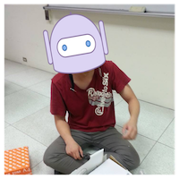

[](https://hub.docker.com/r/kairen/github-bot/) [](https://travis-ci.org/kairen/github-bot) [](https://coveralls.io/github/kairen/github-bot?branch=master)
# Webhook handler for KaiRen's Bot
Make GitLab CI work with a GitHub repository written in Go. The bot watch webhook event to handle something.



## Build
To build bot into a container via Docker:
```sh
$ docker build -t kairen/github-bot:0.1.0 .
```

## Usage
Run bot on Docker as below command:
```sh
$ docker run --rm -ti -e [envs] kairen/github-bot:0.1.0 [options]
$ docker run --rm -ti kairen/github-bot:0.1.0
Usage: github-bot [OPTION]...
github-bot watch your GitHub and GitLab event to handle anything!!

Options:
  -github-token string
    	GitHub access token.
  -gitlab-endpoint string
    	GitLab API Endpoint. (default "https://gitlab.com")
  -gitlab-token string
    	GitLab access token.
  -path string
    	Webhook uri path. (default "/webhooks")
  -port int
    	Webhook server port. (default 8080)
  -secret string
    	Webhook server secret. (default "6324d8bf")

[ERROR] Missing required opts
```
